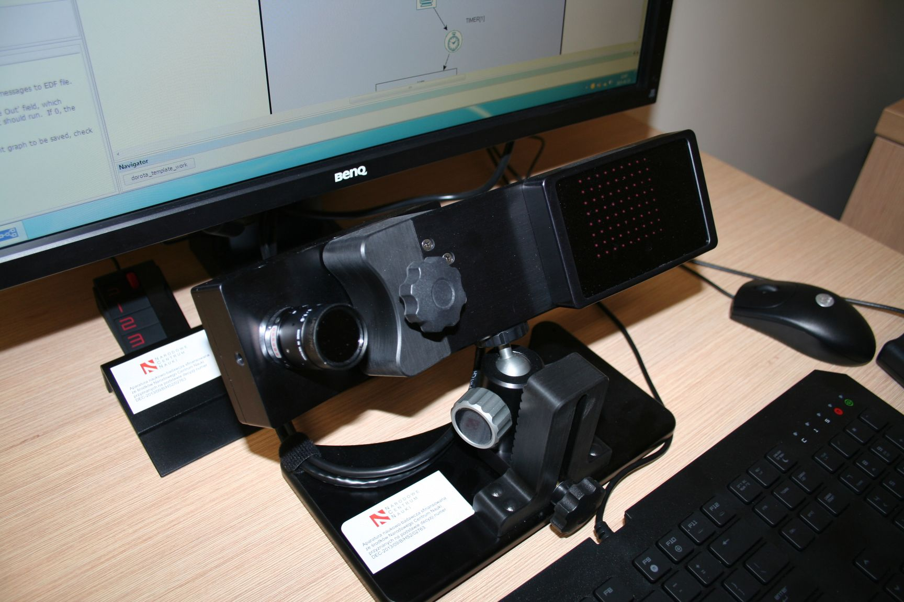
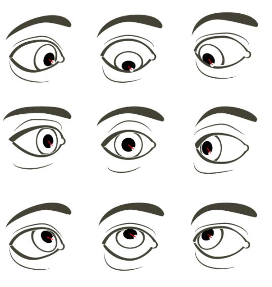

Eye-Tracking Workshop
========================================================
author: Julia and Divya
date: 02.09.2020
autosize: true

For more details on authoring R presentations please visit <https://support.rstudio.com/hc/en-us/articles/200486468>.

The basic idea: What does eye-tracking do?
========================================================

Eye-tracking relies on the **eye-mind hypothesis/assumption**:  
What you look at is what you think about

And furthermore:  
Time is related to processing effort  
Delays hint at processing difficulties

Using eye-tracking, we can track participants' subconscious processes.  
It's an **on-line** (as opposed to off-line) measure of **processing difficulty** with a high temporal resolution.

The basic idea: What does eye-tracking do?
========================================================
type: prompt
incremental: true

Complete this sentence:  
*The old man...*

Now read this sentence:  
*The old man the boat.*

What happened when you read this sentence, and why?  
Which word(s) did you get stuck on?

Typically, people interpret *old* as an adjective which refers to *man* as a noun. But here, *old* is a noun and *man* a verb instead, so in **garden-path sentences** like these, readers need to update their interpretations.  
In this example, we'd typically see a delay on *the* because that's when readers realise their interpretation can't be correct.

How do eye-trackers work?
========================================================

They use a **camera** (left) and an **infrared light** (right)

***

...to track the **pupil** (green) and the **corneal reflection** (red)  
  

How do eye-trackers work?
========================================================
The difference between the **center of the pupil** and the **corneal reflection** is used to calculate the position of the gaze.
***

Eye-tracking systems
========================================================

**Three types of systems:**

- workstation/desktop
- mobile solutions
- eye-tracking glasses

***

Eye-tracking systems: Workstation/desktop
========================================================

Eye-tracking systems: Workstation/desktop
========================================================

Eye-tracking systems: Glasses
========================================================

Considerations
========================================================

**Practicality**
- desktop setups: participants have to travel to the lab
- mobile setups: can be done anywhere

**Naturalness**
- reading in a desktop setups is very different from how you would usually read
- mobile setups feel more natural

***

**Sampling rate**  
- measured in Hz (times per second)  
- = how many pictures the camera takes per second  
- from 25-30 Hz to 1000 Hz or more, depending on the device
- for reading experiments: at least 1000 Hz recommended
- desktop setups tend to have the highest sampling rate

Where can you use eye-tracking?
========================================================
**It's very versatile!**

- Reading (music), also in literary studies
- Cognitive tasks
- Free viewing, scene perception, visual search
- Communication between users and computer systems

***

**Applicability in**
- Linguistics
- Clinical psychology
- Consumer behaviour
- Expertise and training

Typical eye-tracking procedure
========================================================
**... in a reading experiment**

Calibration and validation [(video)](https://youtu.be/FPkRxzSE0bk?t=52)

Once successful, a loop of:
- text
- question
- feedback
- drift correct  

...while managing a long list of potential problems (contact lenses, glasses, mascara or long lashes, small eyes, wet eyes, downward-facing lashes, sunlight, electromagnetic noise in the lab...)

Typical eye-tracking procedure
========================================================

**Experimenter's view:**

...and an example of how our eyes move while we read [(video)](https://www.youtube.com/watch?v=j8-VYcYkgqY)

Let's look at some scan-paths
========================================================

#I think we should show some examples first before we get technical, so I moved this slide up
#I will have to switch to show videos here

What kind of data can you get from eye-trackers?
========================================================
type: prompt
incremental: true

- Fixations: eyes stop, don't move (number of fixations and fixation *duration* commonly analysed)
- Saccades: movements from fixation to fixation
- Microsaccades
- Regressions: backwards movements  
  - short regressions likely due to overshooting
  - long(er) regressions: processing difficulty
- Pupil dilation: can indicate mental load
- Blinks

What parameters could we get from these? How could they compliment each other?

Word of caution: These are not as categorical as may seem.

What does eye-tracking data look like?
========================================================

An example with reading data

What does eye-tracking data look like?
========================================================
**An example of a reading experiment investigating gender stereotypes**

1. The *doctor* enjoyed *his* day off.
2. The *doctor* enjoyed *her* day off.
3. The *nurse* enjoyed *his* day off.
4. The *nurse* enjoyed *her* day off.

Here, we're interested in how people behave when they get to the pronouns *his* and *her*, so the areas/regions of interest (AOIs/ROIs) are those pronouns.  
Often, the AOIs are determined by the design. There are, however, also procedures to find AOIs.

What does eye-tracking data look like?
========================================================

Here is some simulated data from a reading experiment like the one on gender stereotypes explained on the previous slide. Let's spend some time talking about it.
- What are all these columns?
- Do I need them all?
- What could my research questions be?

*Maybe for each of these data sets, they could read in the data and try to wrangle it*

What does eye-tracking data look like?
========================================================

Here is another simulated dataset. Let's spend some time talking about how this one is different.
- What are all these columns?
- Which ones do I need?
- What could my research questions be?

Eye-tracking: Pros and cons
========================================================

**Advantages**
- High temporal resolution
- Non-invasive
- On-line measure of processing
- (Fairly) natural
- No other task needed

***

**Diasadvantages**
- Integrating with behavioural data
- Subjectivity of AOIs
- Operational definitions of fixations/saccades

Visualizations in eye-tracking
========================================================

Many, many ways to do it!
- Maybe an advanced workshop on this?

Considerations
- What kind of analysis you're doing
- Which packages/softwares/shiny apps are available
- Visualizing data versus visualizing statistics

Statistical analysis of eye-tracking data
========================================================
Here we can talk about mixed effects models

Hands-on work
========================================================

Pick one of the two datasets we discussed, and try answering one of the following questions with it

For Dataset A
- x
- y
- z

For Dataset B
- x
- z
- z

