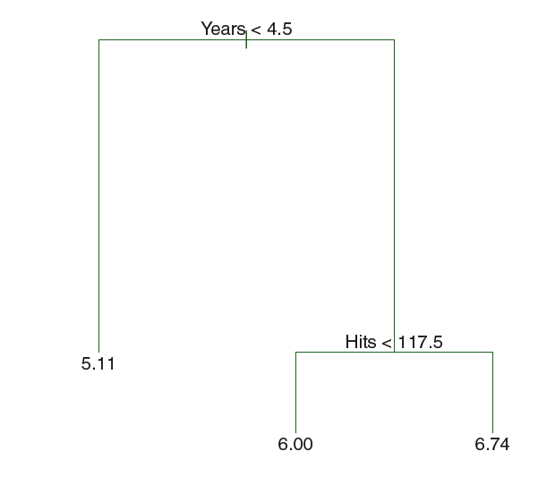
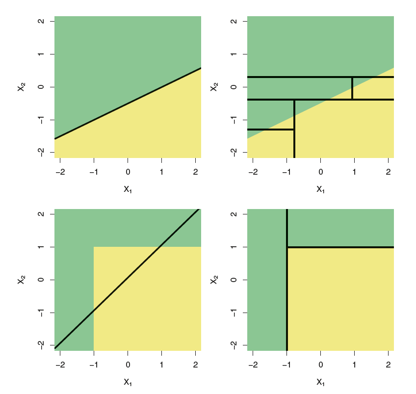
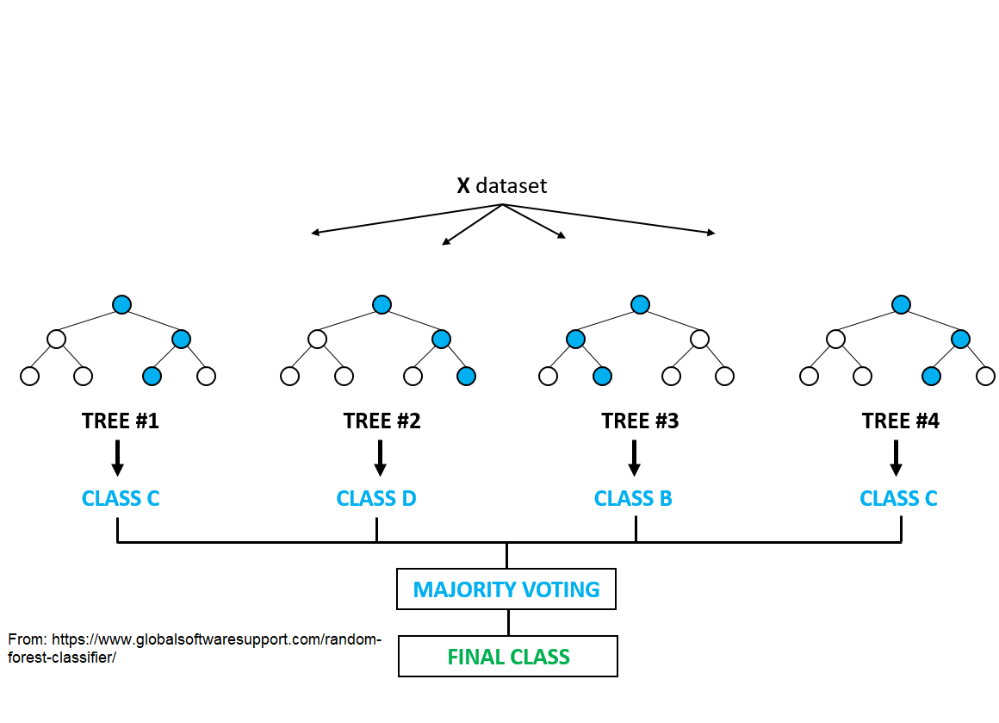
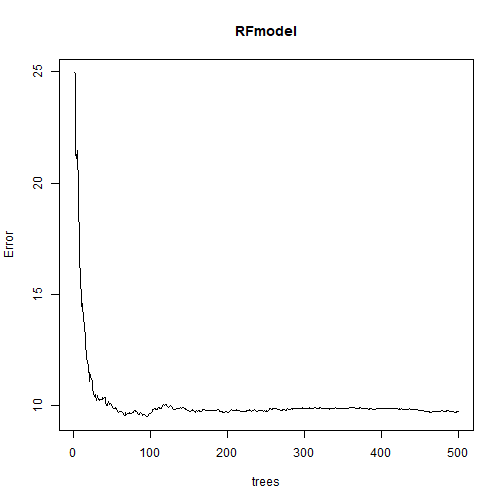
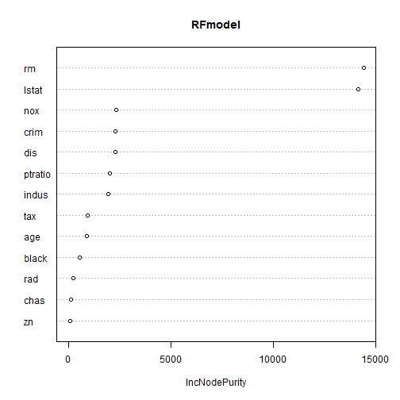

Modelling part 3 -
========================================================
autosize: true


# Machine Learning

## R-Ladies Freiburg

 Wednesday 4th December

Elisa Schneider

Random Forests
========================================================


Tree Based Methods
========================================================

<small> We use the **Hitters** data set to predict a baseball player's **Salary** based on

**Years**: the number of years that he has played in the major leagues and

**Hits**: the number of hits that he made in the previous year. </small>

***


Tree Based Methods
========================================================


***



Tree Based Method Vs. Linear Model
========================================================

<style>


/* heading for slides with two hashes ## */
.reveal .slides section .slideContent h2 {
   font-size: 40px;
   font-weight: bold;
   color: violet;
}

/* ordered and unordered list styles */
.reveal ul, 
.reveal ol {
    font-size: 25px;
}

</style>

Which model is better? 

It depends on the problem at hand. 
- If the relationship between the features and the response is well approximated
by a linear model, then an approach such as linear regression
will likely work well and will outperform a method such as a regression
tree. 

- If instead there is a highly
non-linear and complex relationship between the features and the response
as indicated by model, then decision trees may outperform classical
approaches.


***



High Variance of Trees
========================================================


- The decision trees suffer from high variance: if we split the training data into two parts at random, and fit a decision tree to both halves, the results that we get could be quite different.

- A procedure with low variance will yield similar
results; linear regression tends to have low variance.

- A natural way to reduce the variance and hence increase the prediction
accuracy  is to take many training sets
from the population, build a separate prediction model using each training
set, and average the resulting predictions.

*** 



<style>
.small-code pre code {
  font-size: 1em;
}
</style>

Correlation of Trees
========================================================

- If we create six decision trees with sub-samples of the Boston housing data, we see that the top of the trees all have a very similar structure: Although there are 15 predictor variables, all six trees have both lstat and rm variables driving the first few splits.

- Tree correlation prevents variance reduction. The way Random Forest solve this is randomly choosing a subset of all the predictors that are used at each split. 

***


Example
========================================================
class: small-code


```r
library(readr)
library(randomForest)
library(MASS)
housing <- Boston

RFmodel <- randomForest(medv~., ntree=500, mtry=6, data=housing)

RFmodel
```

```

Call:
 randomForest(formula = medv ~ ., data = housing, ntree = 500,      mtry = 6) 
               Type of random forest: regression
                     Number of trees: 500
No. of variables tried at each split: 6

          Mean of squared residuals: 9.792497
                    % Var explained: 88.4
```

Example
========================================================
class: small-code


```r
plot(RFmodel)
```



***


```r
varImpPlot(RFmodel)
```



Neural Network
========================================================
autosize: true


****


