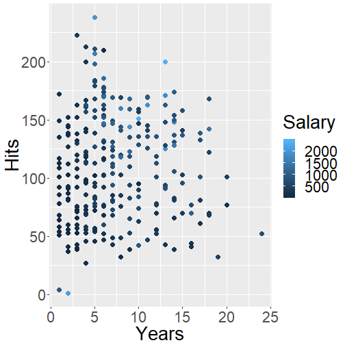

Modelling part 3 -
========================================================
autosize: true

# Machine Learning

## R-Ladies Freiburg

 Wednesday 4th December

Elisa Schneider

Tree Based Methods
========================================================

<small> We use the **Hitters** data set to predict a baseball player's **Salary** based on

**Years**: the number of years that he has played in the major leagues and

**Hits**: the number of hits that he made in the previous year. </small>

***

Tree Based Methods
========================================================

***

Tree Based Method Vs. Linear Model
========================================================

Which model is better? 

It depends on the problem at hand. 
- If the relationship between the features and the response is well approximated
by a linear model, then an approach such as linear regression
will likely work well and will outperform a method such as a regression
tree. 

- If instead there is a highly
non-linear and complex relationship between the features and the response
as indicated by model, then decision trees may outperform classical
approaches.

***

High Variance of Trees
========================================================

<!---
The decision trees discussed in Section 8.1 suffer from high variance.
This means that if we split the training data into two parts at random,
and fit a decision tree to both halves, the results that we get could be
quite different. In contrast, a procedure with low variance will yield similar
results if applied repeatedly to distinct data sets; linear regression tends
to have low variance.

Hence a natural way to reduce the variance and hence increase the prediction
accuracy of a statistical learning method is to take many training sets
from the population, build a separate prediction model using each training
set, and average the resulting predictions.

we simply construct B regression trees using B bootstrapped training
sets, and average the resulting predictions.Hence each individual tree has high variance, but low bias. Averaging these B trees reduces the variance.

Random forests provide an improvement over bagged trees by way of a
random
small tweak that decorrelates the trees.
-->
